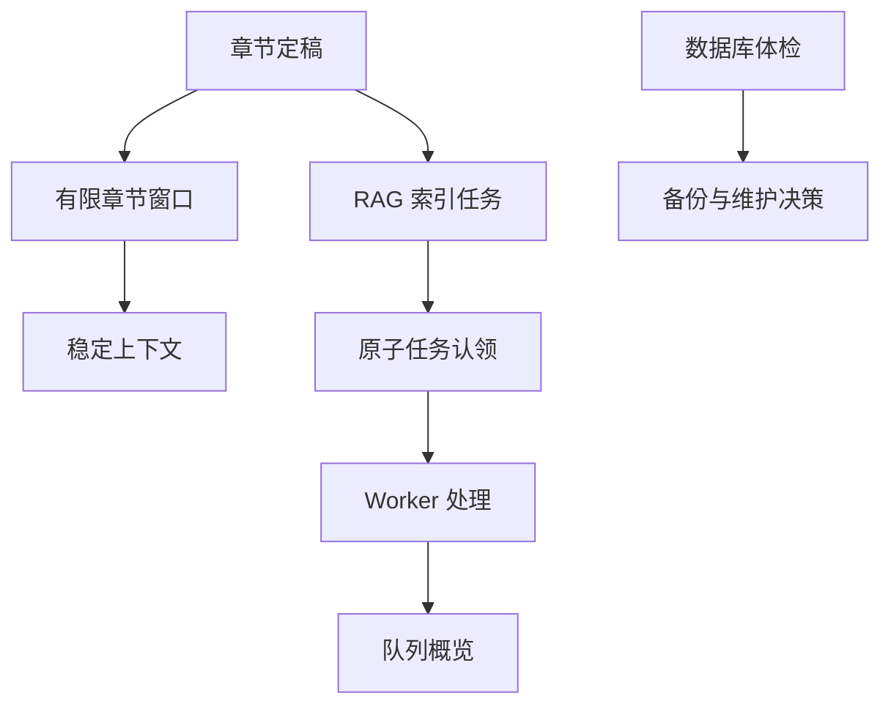

# 长篇生产稳定性优化

Feature Name: long-novel-stability
Updated: 2026-08-25

## Description

本阶段优化长篇小说的上下文规模、RAG 后台任务可观测性和 SQLite 数据维护安全。改动通过现有服务边界完成，不改变章节生产和自动导演的业务事实源。

## Architecture

## Components and Interfaces

- `PayoffLedgerSyncService`：卷级摘要与章节窗口查询。
- `StateService`：按章节顺序直接查询最新可用状态快照。
- `RagIndexService`：提供队列统计和原子任务认领。
- `RagWorker`：按可配置并发度处理索引任务，任务认领通过数据库条件更新保证单任务单 Worker。
- `routes/rag.ts`：提供认证后的队列概览接口。
- `scripts/inspect-db.cjs`：只读 SQLite 体检。

## Data Models

继续使用 `RagIndexJob`，通过状态、`runAfter`、`attempts` 和 `lastError` 表达队列生命周期。阶段改动不删除或重写既有状态快照。

## Correctness Properties

- 同一个 RAG 任务在同一时刻最多由一个 Worker 认领。
- 任务失败后仍按现有最大尝试次数和退避时间运行。
- 章节窗口查询不会改变卷级开放伏笔的语义。
- 数据库体检不会写入 SQLite 文件。

## Error Handling

- RAG 队列统计失败时返回统一 API 错误，由现有错误处理中间件处理。
- Worker 认领冲突时跳过本轮任务并继续轮询。
- 数据库体检遇到非 SQLite 数据库或文件缺失时返回明确命令行错误。

## Test Strategy

- 测试章节窗口的边界和无章节序号兼容路径。
- 测试两个并发 Worker 对同一任务的原子认领。
- 测试 RAG 队列统计的状态计数和失败计数。
- 测试数据库体检脚本语法与 SQLite `quick_check` 输出。

## References

- `server/src/services/payoff/PayoffLedgerSyncService.ts`
- `server/src/services/state/StateService.ts`
- `server/src/services/rag/RagIndexService.ts`
- `server/src/services/rag/RagWorker.ts`
